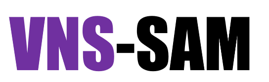
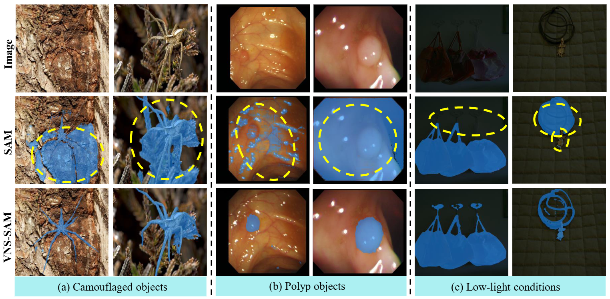
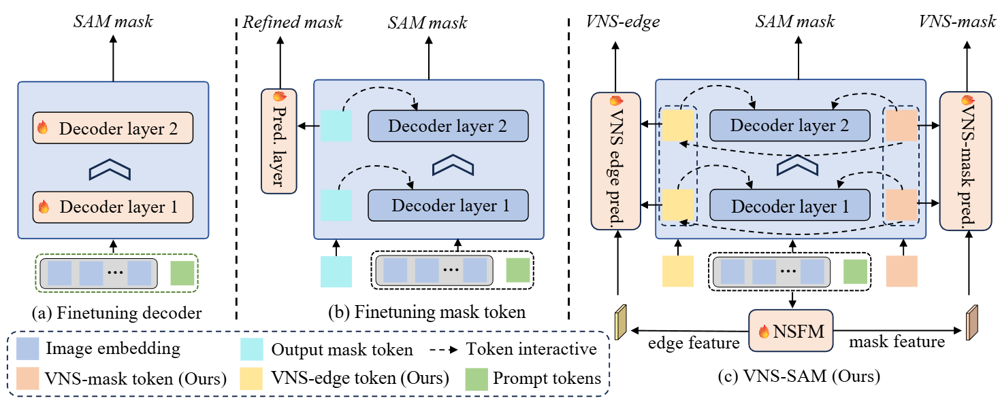

<p align="center">
    
</p>

# [IEEE TIP] Boosting Segment Anything Model to Generalize Visually Non-Salient Scenarios

<div align="center">
<a href="https://guangqian-guo.github.io/">Guangqian Guo</a><sup><span>1</span></sup>, 
<a href="mailto:chenpengfei20@mails.ucas.ac.cn">Pengfei Chen</a><sup><span>2</span></sup>,
<a href="mailto:guoyongcs@gmail.com">Yong Guo</a><sup><span>3</span></sup>,
<a href="mailto:chf@mail.nwpu.edu.cn">Huafeng Chen</a><sup><span>1</span></sup>,
<a href="mailto:cyril@mail.ustc.edu.cn">Boqiang Zhang</a><sup><span>4</span></sup>,
<a href="https://teacher.nwpu.edu.cn/2018010158.html">Shan Gao</a><sup><span>1</span></sup>
<br>
<sup>1</sup> Northwestern Polytechnical University <sup>2</sup> University of Chinese Academy of Sciences <br>
<sup>3</sup> Max Planck Institute for Informatics <sup>4</sup> University of Science and Technology of China <br>
    </div>


 <a href='https://guangqian-guo.github.io/VNS-SAM/'></a> <a href='https://ieeexplore.ieee.org/document/10810787'></a> <a href='https://guangqian-guo.github.io/VNS-SAM/'></a>

**Boosting SAM's perception in visually non-salient scenarios (Camouflage, Polyp, Low-light, etc.) while preserving zero-shot generalizability.**
<p align="center">
    
</p>

> **Abstract:** Segment Anything Model (SAM), known for its remarkable zero-shot segmentation capabilities, has garnered significant attention. Nevertheless, its performance is challenged when dealing with visually non-salient (VNS) scenarios, where there is low contrast between the foreground and background. In this paper, we propose Visually Non-Salient SAM (**VNS-SAM**), aiming to enhance SAM's perception of visually non-salient scenarios while preserving its original zero-shot generalizability. We achieve this by effectively exploiting SAM's low-level features through two designs: **Mask-Edge Token Interactive (METI) decoder** and **Non-Salient Feature Mining (NSFM) module**. These designs help the SAM decoder gain a deeper understanding of non-salient characteristics with only marginal parameter increments (9.8M) and computational requirements. In terms of data, we established **VNS-SEG**, a unified dataset for various VNS scenarios, with more than 35K images. Extensive experiments across various VNS segmentation tasks demonstrate the superior performance of VNS-SAM, particularly under zero-shot settings.

###### ⭐ If this work is helpful for you, please help star this repo. Thanks! 🤗
---
## 📑 Contents

- **[Update](#🔥Update)**
- **[Todo](#Todo_List)**
- **[Results](#results)**
- **[Method](#method)**
- **[Environment](#setup)**
- **[VNS-SEG Dataset](#dataset)**
- **[Train](#📈Train)**
- **[Evaluation](#📈Evaluation)**
- **[Citation](#citation)**
---
## 🔥Update
- **[01/2026]** 🔥 **VNS-SAM** has been accepted by **IEEE Transactions on Image Processing (TIP)**!
- **[12/2025]** 🔥 We release the code, models, and the **VNS-SEG** dataset.
- **[09/2025]** 🔥 Project page is live at [guangqian-guo.github.io/VNS-SAM/](https://guangqian-guo.github.io/VNS-SAM/).
---
## <a name="Todo_List"></a>Todo List

- [x] Release training & evaluation code.
- [x] Release pre-trained weights (VNS-SAM).
- [x] Release the unified VNS-SEG dataset.
---
## <a name="method"></a>📑 Method Overview
<p align="center">
    
</p>
VNS-SAM introduces two lightweight components to the frozen SAM backbone:

1.  **Mask-Edge Token Interactive (METI) Decoder:**
    * Introduces **VNS-Mask** and **VNS-Edge tokens**.
    * Uses **Dual-level Prediction Enhancement** to hierarchically supervise mask and edge predictions.
    * Performs explicit token fusion to aggregate edge semantics into the mask token.

2.  **Non-Salient Feature Mining (NSFM):**
    * Extracts high-frequency (edge) and low-frequency (mask) components from the frozen Image Encoder using Haar Wavelet Decomposition.
    * Enriches the representation of the prediction layers with multi-level features.
---
## <a name="setup"></a>📷 Environment Setup
Please follow the instructions below to install the required packages.
1. Clone this repository
```bash
git clone https://github.com/guangqian-guo/VNS-SAM.git
cd VNS-SAM
```

2. Install Package
```bash
conda create -n vnssam python=3.9
conda activate vnssam
pip install -r requirements.txt
```

3. Download Pre-trained Models
```bash
SAM: Download sam_vit_h_4b8939.pth from Segment Anything.

VNS-SAM Checkpoint: Download from [Releases].
```
---
## <a name="dataset"></a>💡 VNS-SEG Dataset
We established VNS-SEG, a unified dataset for visually non-salient segmentation, containing over 35K image-mask pairs. It aggregates existing datasets and synthesizes low-light data to cover diverse VNS scenarios.

Training Set (23,232 images):
- Camouflage: COD10K, CAMO.
- Polyp: Kvasir, ClinicDB.
- Low-light (Synthesized): DIS-Dark, Thin-Dark, FSS-Dark (generated via CycleGAN).

Evaluation Set:
- Seen-Set: Test splits of the training datasets.
- Unseen-Set (Zero-shot): NC4K (Camouflage), ColonDB & ETIS (Polyp), LIS (Real Low-light), CDS2K (Industrial Defects).
---
## 📈Train
```bash
torchrun --nproc_per_node=4 --master_port=10113  MyTrain.py   --checkpoint sam_vit_l_0b3195.pth  --model-type vit_l  --output [output_dir] --dataset  ns 
```
Our model is trained on 4x 4090 GPUs.

## 📈Evaluation
```bash
torchrun --nproc_per_node=4 --master_port=10113  MyTrain.py   --checkpoint sam_vit_l_0b3195.pth  --model-type vit_l  --output [output_dir] --dataset  ns  --eval  --restore-model [trained_model_path]  --model vns-sam  --prompt box
```

## Citation

If you find this repo useful for your research, please consider citing the paper:
```
@article {guo2026vnssam,
  author    = {Guo, Guangqian and Chen, Pengfei and Guo, Yong and Chen, Huafeng and Zhang, Boqiang and Gao, Shan},
  title     = {Boosting Segment Anything Model to Generalize Visually Non-Salient Scenarios},
  journal   = {IEEE Transactions on Image Processing},
  year      = {2026},
  doi       = {10.1109/TIP.2026.3651951}}
```

## Acknowledgement

We would like to thank the following repos for their great work:
- [Segment-Anything-Model](https://github.com/facebookresearch/segment-anything).
- [HQSAM]()
- [CycleGAN]() (used for synthesizing low-light data)


## License

This project is released under the [Apache 2.0 license](https://github.com/RainBowLuoCS/DEEM/blob/main/LICENSE). Parts of this project contain code and models from other sources, which are subject to their respective licenses.
